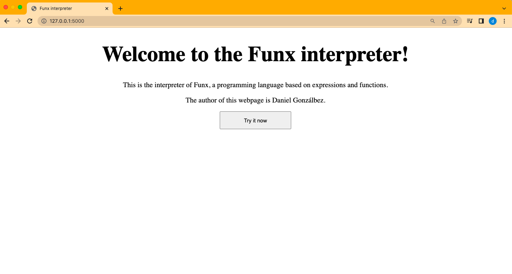
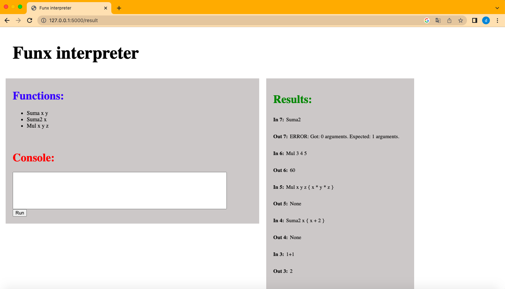

# Funx interpreter

This project aims to develop an interpreter for a language based on expressions and functions. The input and output of the interpreter is done via a web page. 

It can be divided in 3 parts:
1. [Grammar of the language](#grammar-of-the-language)
2. [Abstract Syntax Tree visitor](#abstract-syntax-tree-visitor)
3. [The interpreter](#the-interpreter)

## Grammar of the language

Funx is a language that allows us declare functions (zero or more) and, optionally, define a final expression. Its syntax is specified in its grammar (funx.g4).

```bash
grammar funx ;

root : declare_function* expr? EOF; 

declare_function : FUN VAR* '{' bloc '}' ;
```
The names of the functions (FUN in the grammar) start with a capital letter, while the formal parameters (VAR in the grammar) start with a lower case letter.

It supports the most common arithmetic operands (+, -, *, /, %, ^) as well as some logical operators (=, !=, <, >, <=, >=). It also supports the boolean operators 'and' and 'or'. They all return 1 if an expression is True and 0 in the opposite case.

Funx contemplates different instructions, that are indicated in the grammar, such as the assignment of values to local variables (there are no global variables, if a variable inside a function is used without being defined, its value is 0), if and if-else constructions or loops using the keyword while.


## Abstract Syntax Tree visitor

From the grammar, an abstract syntax tree (AST) is created with the help of ANTLR. This AST is visited through the visitors, whose interface (that describes its minimum behavior) is also generated with ANTLR. Then we have to develop the specific implementation of the visitor, which navigates through the ASTs.

The class Evalvisitor (that inherits the class funxVisitor defined in the interface) contains different methods corresponding to the different rules declared in the grammar. All the methods start by getting a list of all the elements in the context with: ```l = list(ctx.getChildren())```. The length of this list depends on the specification of each method in the grammar. For example, the method corresponding to the if-else instruction will get a list of 9 elements, but we will be just using the ones in positions 1, 3 and 7. 

The root method gets all the elements in the context and visits them one by one (if there is an expression, it will return its result). The same happens with the list of instructions contained in a block. The visitBloc method runs through them. Apart from that, two objects that the class contains and are fundamental when navigating through the AST nodes are a dictionary called func_dict and a list of dictionaries named symbol_stack: 

The first one is updated when a new function is declared. The keys of the dictionary are the names of the defined functions and point to two values: a list with its formal parameters and the context block that contains the content of the function. 

The latter one is used every time a function is called. The last appended dictionary (it is added to the list when a function is called) contains the correspondance between the names of the formal parameters (extracted from func_dict) and the given values in a call. After visiting the list of instructions (that were saved in the dictionary of functions) and obtaining its result, the last element of symbol_stack is removed.


#### Errors:

It detects the following errors:

- Call to undefined function.
- Division or modulo by zero.
- Definition of an already defined function.
- Repetition of names for the formal parameters of a function.
- Incorrect number of given parameters.
- Try to define or evaluate global variables.


## The interpreter

The inputs and outputs of the Funx interpreter are processed via a web page. This service has been developed with ```flask``` in combination with the library ```Jinja2``` to generate and render HTML templates. 

The webpage looks like that:



Once the user presses the button that says "Try it now", the user is led to the interpreter (with route '/begin' and then with route '/result'). It contains three sections:

- **Functions**: It contains the names of the functions that have been declared. It obviously starts empty.

- **Console**: It is a box that admits text coming from the user. When the input is ready, the "Run" button should be pressed.

- **Results**: It displays the last five given inputs and obtained responses (including errors).

It looks like that:




## Running the webpage:

If the user wants to run the webpage, ANTLR4 must be installed. Firstly, the ANTLR4 jar file must be downloaded, so that it can be installed with: 
```bash
pip install antlr4-python3-runtime
```

Then, with:
```bash
antlr4 -Dlanguage=Python3 -no-listener -visitor funx.g4
```
we generate the ```funxVisitor.py``` file, which is the interface of the visitor that has been implemented in this project, as well as the ```funxLexer.py```, ```funxLexer.tokens```, ```funxParser.py``` and ```funx.tokens``` files. 

Then, the libraries flask and Jinja2 must be installed. This can be done in Linux with:
```bash 
pip install flask
pip install Jinja2
```

Now the webpage can be run with the follwong commands:
```bash 
export FLASK_APP=web.py
flask run
```


